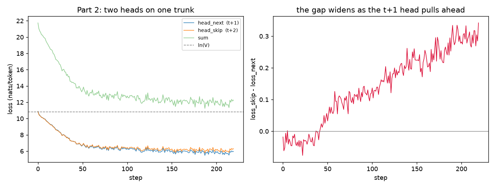
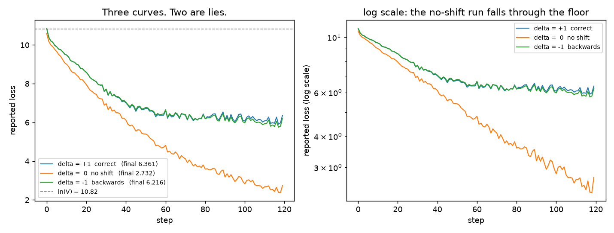

# The Loss Harness: What Happens Between Model Output and the Scalar

[](https://colab.research.google.com/github/pyru/S-9_ERAv5/blob/main/loss_harness.ipynb)

Making these six lines **correct** and **observable**:

```python
hidden = model(tokens)
logits = output_head(hidden)
loss = cross_entropy(
    logits[:, :-1].reshape(-1, vocab_size),
    tokens[:, 1:].reshape(-1),
)
```

They are short, they run, and they never raise. That is exactly why they are dangerous.

> **Every number and every console block below is extracted from
> [`loss_harness.ipynb`](loss_harness.ipynb)'s own committed outputs by [`make_readme.py`](build/make_readme.py).
> None of it is typed in by hand.**

| | |
|---|---|
| Notebook | [`loss_harness.ipynb`](loss_harness.ipynb) — runs top to bottom, outputs committed |
| Raw numbers | [`results.json`](results.json) |
| Full console log | [`training_log.txt`](training_log.txt) |
| Model | 4-layer causal transformer, d=256, 4 heads, block=128 |
| Tokenizer | GPT-2 byte-level BPE, V=50,257 |
| Parameters | 16,058,112 (tied head) |
| Corpus | TinyShakespeare |

---

## Part 1 — the seven numbers

| # | Check | Result |
|---|---|---|
| 1 | Shapes | `logits (4, 16, 50257)` → **60 rows × 50,257 classes** into cross entropy |
| 2 | Shift verified on strings | `target[i] == input[i+1]` on every row — **0 mismatches** |
| 3 | Padding mask | contributing tokens **24 → 18**, loss 7.3775 → 5.2811 |
| 4 | Packing boundary | over 47 seams, loss **5.8591 → 5.8235**; seams cost 9.208 vs 5.8235 elsewhere |
| 5 | Untrained perplexity | **51,917.5** vs vocab 50,257 — **ratio 1.033** |
| 6 | Tied vs untied head | **16,058,112** vs **28,923,904** — **+12,865,792** |
| 7 | Peak memory, ordinary vs chunked | **639.03 MB → 124.77 MB — 5.12×** |

### 1. Every tensor shape, and what each dimension is

```
tokens        (4, 16)            B=4 sequences in the batch, T=16 positions each
hidden        (4, 16, 256)       B, T, D=256 residual-stream channels per position
logits        (4, 16, 50257)     B, T, V=50,257 scores, one per vocab entry
pred_logits   (4, 15, 50257)     drop the last position: no target for it in-window
targets       (4, 15)            drop the first token: it is never predicted
flat_logits   (60, 50257)        N = B*(T-1) = 60 independent predictions
flat_targets  (60,)              N class indices, one integer per prediction
```

The assertion that matters is `flat_logits.shape[0] == flat_targets.shape[0]`. **A wrong shift
still satisfies it** — which is the whole problem, and why check 2 exists.

### 2. The shift, verified on token strings

Integers hide off-by-ones. Strings do not.

```
shift = +1  (CORRECT: predict the NEXT token)

 pos  INPUT  logits row i reads this      TARGET  must predict this     
--------------------------------------------------------------------------
   0  'IL'                                'IA'                          
   1  'IA'                                ':'                           
   2  ':'                                 '⏎'                           
   3  '⏎'                                 'B'                           
   4  'B'                                 'es'                          
   5  'es'                                'ee'                          
   6  'ee'                                'ch'                          
   7  'ch'                                '␣you'                        
   8  '␣you'                              ','                           
   9  ','                                 '␣give'                       
  10  '␣give'                             '␣me'                         
  11  '␣me'                               '␣leave'                      
  12  '␣leave'                            '␣to'                         
  13  '␣to'                               '␣retire'                     
--------------------------------------------------------------------------
target[i] == input[i+1] for every row : True
mismatches found                      : 0
```

The target column is the input column slid up exactly one row. `␣` marks a leading space and
`⏎` a newline — byte-level BPE makes whitespace a real token, which is exactly where an
off-by-one hides.

### 3. Padding mask changes the denominator

| | contributing tokens | loss |
|---|---|---|
| no mask | 24 | 7.3775 |
| `ignore_index=-100` on pads | **18** | **5.2811** |

6 pad targets dropped.

**The direction of the error is not fixed — do not memorise one.** Here the pad positions drag
the reported loss **UP** by 2.0964 nats,
because this reference model was trained on Shakespeare and has never seen `<|endoftext|>`, so
pads are *hard* for it. In a normal training run pads are frequent and `PAD → PAD` is trivial,
so the unmasked loss is dragged the other way and the model looks **better** than it is. Either
way the unmasked number is not the loss on the task you care about, so the notebook prints which
way it went rather than asserting one.

### 4. Packing two documents, and masking the seam

Packing concatenates documents to avoid wasting compute on padding. The cost is one poisoned
position per seam: **input = last token of doc A, target = first token of doc B**.

```
the neighbourhood of the seam (prediction rows):
 row  INPUT             TARGET          
------------------------------------------
  12  '␣afternoon'      '␣sun'          
  13  '␣sun'            '.'             
  14  '.'               'Qu'               <== BOUNDARY: last token of A -> first token of B
  15  'Qu'              'arter'         
  16  'arter'           'ly'            
```

One seam on a small model is an anecdote, so the notebook repeats it over
**47 real document pairs** drawn from the corpus:

| positions | mean loss |
|---|---|
| document seams | **9.208** |
| everywhere else | **5.8235** |

Seam positions cost **+3.3845 nats** more than
ordinary positions — 1.58× the interior rate.
Loss over all positions **5.8591**, with seams masked **5.8235**.

**Explaining the difference.** The masked loss is the unmasked loss with those terms removed
from *both* numerator and denominator. The seam terms sit far above average because
`.` → `Qu`(arterly) is not a language-modelling fact — it is an artefact of how the shuffler
happened to concatenate two unrelated documents. Leaving them in does two bad things: it
inflates reported loss (cosmetic), and it sends gradient teaching the model that arbitrary topic
jumps after a period are likely (substantive). At scale, with thousands of seams per batch, the
second is the one that hurts. Production packing also resets position ids and blocks attention
across the seam; masking the target is the minimum correct step.

### 5. Perplexity of an untrained model sits at vocabulary size

An untrained model is uniform over V classes → loss `ln(V)`, perplexity `exp(ln V) = V`.

| model | loss | perplexity | ratio to V |
|---|---|---|---|
| **buggy init** — PyTorch default `N(0,1)` embedding | — | **1.665e+73** | astronomically wrong |
| **fixed init** `std=0.02`, untrained | 10.8574 | **51,917.5** | **1.033** |
| after 250 steps | — | 251.4 | 0.0050 |

`ln(V) = 10.8249`, measured `10.8574`.

**This check caught a real bug.** `nn.Embedding` defaults to `N(0, 1)`; with a tied head the
logits `h @ E.T` have a standard deviation of about `sqrt(D)` = 16, the loss is in the hundreds,
and perplexity lands at `1.665e+73`. Training that model would have produced a curve
descending from an absurd height that looks like excellent progress. The init was fixed before
anything else was measured.

### 6. Tied vs untied output head

Config `V=50,257, D=256, 4 layers, 4 heads, block=128`:

| | parameters |
|---|---|
| tied — `head.weight is tok_emb.weight` | **16,058,112** (16.06M) |
| untied — its own `V×D` matrix | **28,923,904** (28.92M) |
| difference | **+12,865,792** = `V*D` = 50,257×256 |

Untied is **1.80×** the tied model, and that single
matrix is **44.5%** of the untied total. At this
scale the model is mostly vocabulary — the transformer blocks are a small minority of the
parameters.

### 7. Peak memory: ordinary vs chunked cross entropy

The `(B, T, V)` logits tensor is the largest allocation in a LM step. Ordinary cross entropy
materialises it, `log_softmax` materialises another the same size, and backward materialises the
gradient — three copies of `B*T*V` floats.

The chunked version is a hand-written `torch.autograd.Function`: forward computes each slice of
logits, folds it into the loss sum and **throws the slice away**; backward **recomputes** that
slice and turns it straight into `grad_hidden` and `grad_weight`. One extra matmul buys the peak.

Config `B=4, T=256, D=256, V=50,257`, 16 chunks — a full fp32 logits tensor is 196.3 MB.

```
ordinary cross entropy : peak   639.03 MB   (loss 10.8411)
chunked  cross entropy : peak   124.77 MB   (loss 10.8411)

ratio ordinary/chunked : 5.12x   (saved 514.3 MB, 80.5%)
```

| | peak memory |
|---|---|
| ordinary `cross_entropy` | **639.03 MB** |
| chunked, 16 slices | **124.77 MB** |
| **ratio** | **5.12×** (80.5% saved) |

**Correctness first:** identical loss and max gradient difference **2.10e-09**
against ordinary cross entropy, with masked rows included in the check. A memory saving that
changes the answer is not a saving.

Measured with `TorchDispatchMode live-byte high-water mark`. The floor for the chunked version is `grad_weight` at
`V*D*4` = 49.1 MB — a real parameter gradient that cannot be chunked away.

> **Two measurement bugs worth recording, because neither raised an exception.**
>
> Writing `g_W += p.t() @ hc` in the backward allocates a full `V×D` temporary **per chunk**,
> which made the "optimised" path use *more* peak memory than the ordinary one — 153 MB vs
> 123 MB on the first attempt. `g_W.addmm_(p.t(), hc)` is what makes it work.
>
> And `torch.cuda.max_memory_allocated()` is an *absolute session* figure. By this point the
> session holds several trained models plus optimizer states, and that constant baseline was
> being added to both sides, compressing a genuine ~5× win into a reported **1.30×** on GPU.
> The CPU tracker only counts tensors born inside the measured block, so it was already a
> delta. `measure_peak` now subtracts the CUDA baseline so both paths measure the same thing.

---

## Part 2 — a second head predicting token `t+2`

Same trunk, two heads:

* `head_next` — `hidden[:, i]` → `tokens[:, i+1]`: `logits[:, :-1]` vs `targets[:, 1:]` (tied)
* `head_skip` — `hidden[:, i]` → `tokens[:, i+2]`: `logits[:, :-2]` vs `targets[:, 2:]` (untied)

Trained together for 220 steps on `loss_next + loss_skip`.

| | loss_next (t+1) | loss_skip (t+2) | gap |
|---|---|---|---|
| first 20 steps | — | — | -0.0325 |
| **last 20 steps** | **5.8013** | **6.0979** | **+0.2966** |
| perplexity (last 20) | 330.7 | 444.9 | |

**Sum of the two losses: 11.8992.**



### What happens to the second head, and why

**What we see.** Both losses start at `ln(V) = 10.8249` and both fall. `loss_skip` stays above
`loss_next` and the gap **widens** — from -0.0325 over the first 20 steps to +0.2966
over the last 20. Note the gap starts very slightly *negative*: at initialisation both heads are
uniform and the ordering is pure noise.

**Why.** Early on neither head knows anything, both sit at `ln(V)`, and the gap is ≈0. The first
thing a language model learns is cheap *local* structure — the token after `␣th` is `e`; the
token after a newline in Shakespeare is a capitalised speaker name. Nearly all of that structure
is immediately adjacent, so it is available to `head_next` and mostly destroyed by one step of
distance for `head_skip`. `head_next` banks the easy wins first and pulls away.

There is also a floor under `head_skip` that `head_next` does not have. The `t+2` head models
`p(x_t+2 | x_≤t)`, which has marginalised out the intervening token:

```
H(x_t+2 | x_≤t)  =  H(x_t+2 | x_≤t+1)  +  I(x_t+2 ; x_t+1 | x_≤t)
```

That second term — how much the unseen token at `t+1` tells you about the one after it — is
strictly positive for real text, and no amount of training removes it. So `loss_skip` cannot
converge to `loss_next`; it converges to `loss_next` plus that mutual information. The widening
gap is the model finding that floor.

**Why bother.** This is multi-token prediction (Gloeckle et al. 2024; used in DeepSeek-V3). The
extra head is not there to be good at `t+2` — it is a training signal. It forces the residual
stream at position `t` to carry information about the near future rather than only the immediate
next token: a denser gradient per forward pass, which tends to improve the `t+1` head. At
inference the skip head is usually discarded, or used to draft tokens for speculative decoding.
`head_skip` is deliberately left **untied** — tying it to `tok_emb` would put two different
objectives on one matrix and let the `t+2` task corrupt the input embeddings.

---

## Part 3 — the warning, reproduced

> *"A target shift in the incorrect direction can produce a beautiful loss curve."*

Three harnesses, identical except for which slice pairs with which:

| variant | code | hidden at `i` is asked to predict |
|---|---|---|
| `delta=+1` **correct** | `logits[:, :-1]` vs `tokens[:, 1:]` | token `i+1` — not yet seen |
| `delta=0` **no shift** | `logits` vs `tokens` | token `i` — **already in its own input** |
| `delta=-1` **backwards** | `logits[:, 1:]` vs `tokens[:, :-1]` | token `i-1` — **already attended to** |



```
  variant             reported   true next-token
  +1 correct            6.3608            6.1375
   0 no shift           2.7315            8.3537
  -1 backwards          6.2157            7.1036

  no-shift   reports 2.7315, which is BELOW the correct run's 6.3608 -> looks as good or better,
             but its TRUE next-token loss is 8.3537 vs 6.1375, +2.2162 worse.

  backwards  reports 6.2157, which is BELOW the correct run's 6.3608 -> looks as good or better,
             but its TRUE next-token loss is 7.1036 vs 6.1375, +0.9661 worse.

  Both broken runs are still better than untrained (10.86) - they did learn something,
  just not the task. Only the true-loss column separates them. Print the strings.
```

**Both broken variants report a LOWER loss than the correct run.** If the reported curve were
your only instrument, you would rank them *above* the run that is actually working.

### The two do not fail equally — and the subtle one is worse

`delta=0` collapses to **2.7315** because it only has to echo the token already
sitting in its own residual stream. `delta=-1` lands at **6.2157**, only
0.1451 below the correct run, because it must
learn an attention head that looks back exactly one position — easy, but not free.

**That makes `delta=-1` the more dangerous bug.** A curve that collapses toward zero is obviously
suspicious and somebody investigates. A curve sitting 2%
below where it should be looks like a *good run*. Nothing in the reported number distinguishes it.

Note also what is **not** true: both broken models still beat the untrained baseline of
10.8574. They did learn something — just not the task. Only the true-loss column
separates them.

### Caught by printing the strings

```
delta =  0  no shift

 pos  INPUT  logits row i reads this      TARGET  must predict this     
--------------------------------------------------------------------------
   0  ','                                 ','                             <-- IDENTICAL
   1  '␣that'                             '␣that'                         <-- IDENTICAL
   2  '␣Romeo'                            '␣Romeo'                        <-- IDENTICAL
   3  "'s"                                "'s"                            <-- IDENTICAL
   4  '␣faithful'                         '␣faithful'                     <-- IDENTICAL
   5  '␣wife'                             '␣wife'                         <-- IDENTICAL
   6  ':'                                 ':'                             <-- IDENTICAL
  -> the target IS the input. The model reads token i and is graded on token i.
     Copying is cheap, so the reported loss drops below the correct run's.
     The model does learn - it just learns to copy, which is not the task.
```

**Print the strings.**

---

## Reproducing

```bash
pip install -r requirements.txt
jupyter nbconvert --to notebook --execute --inplace loss_harness.ipynb
```

Or open it in Colab with the badge at the top.

The committed outputs are from a **CPU** run (~31 minutes). The same notebook was independently
run on a Colab **T4 GPU** and reproduced all 40 recorded
numbers **exactly**, except check 7, which is device-dependent by construction and switches to
`torch.cuda.max_memory_allocated` automatically. Seeds are fixed throughout.
